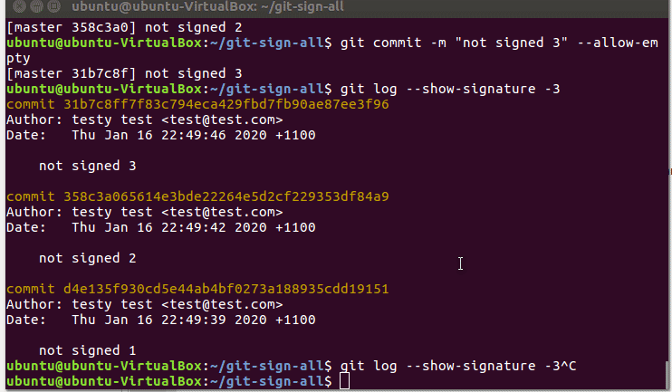

# git-sign-all
Retrospectively GPG sign all of your previous commits.

## Install
``` sh
$ git clone https://github.com/ducthienbui97/git-sign-all.git
$ cd git-sign-all
$ sudo make install
```

## Usage
``` sh
$ git sign-all
```
or
``` sh
$ git sign-all <author_email>
```
